## LimaCharlie (EDR) Telemetry
- Windows 11 (Target) with Virus & Threat Prodection disabled, Sysmon and LimaCharlie (EDR) Sensor installed.
- Ubuntu Server (Attack) with Sliver, a Command & Control (C2) framework by BishopFox, installed.
- Generate C2 payload using Sliver, execute payload from Target machine, and start C2 session on Sliver.
- Use C2 session to perform two attacks on Target Machine:
    - LSASS access (credentials stealing)
    - Shadow Copies deletion using vssadmin.exe (used in Ransomware attacks).
- Create Detection & Response rules in LimaCharlie (EDR) to detect the two previous attacks using
the telemetry generated by them and test the rules by performing the attacks again.

The procedures to build this Lab can be found [here](https://github.com/robsann/LimaCharlieEDRTelemetry/blob/main/procedure.md) and it was adapted from [Eric Capuano](https://blog.ecapuano.com/p/so-you-want-to-be-a-soc-analyst-intro).

## Highlights
### VirtualBox NAT Network with Port Forwarding configuration
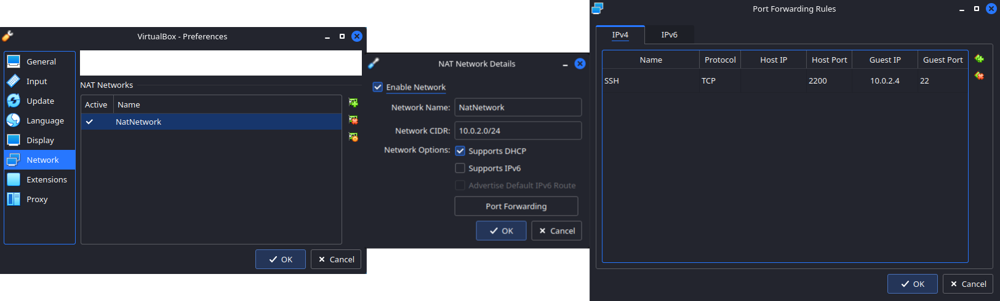

### Network configuration of Ubuntu Server (10.0.2.4) and Windows 11 (10.0.2.5)
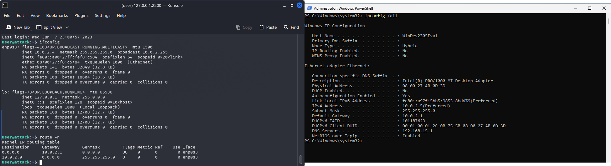

### Windows 11 Virus & threat protection disabled
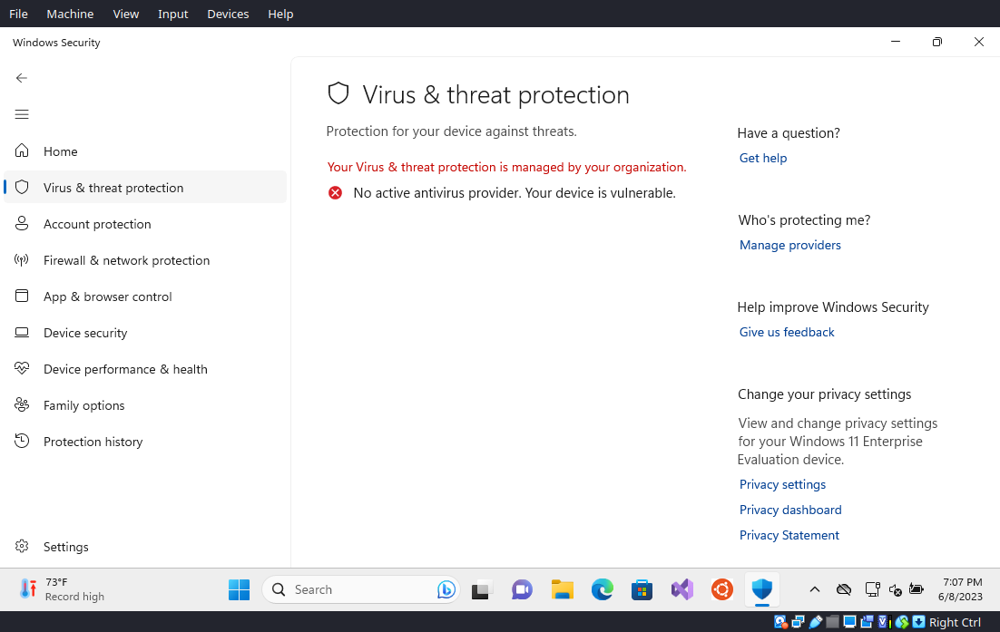

### Windows 11 Sysmon events
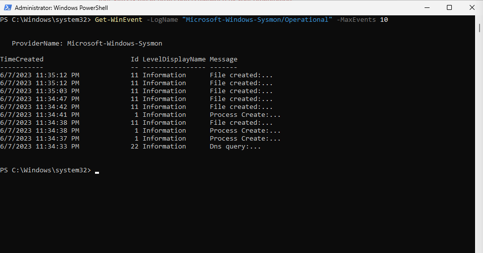

### Payload generation on Sliver on the Attack Machine
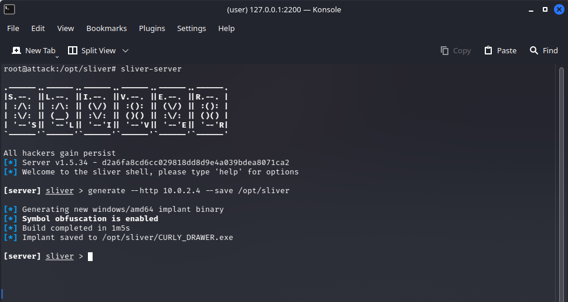

### LimaCharlied Timeline event of the payload download on Windows Machine
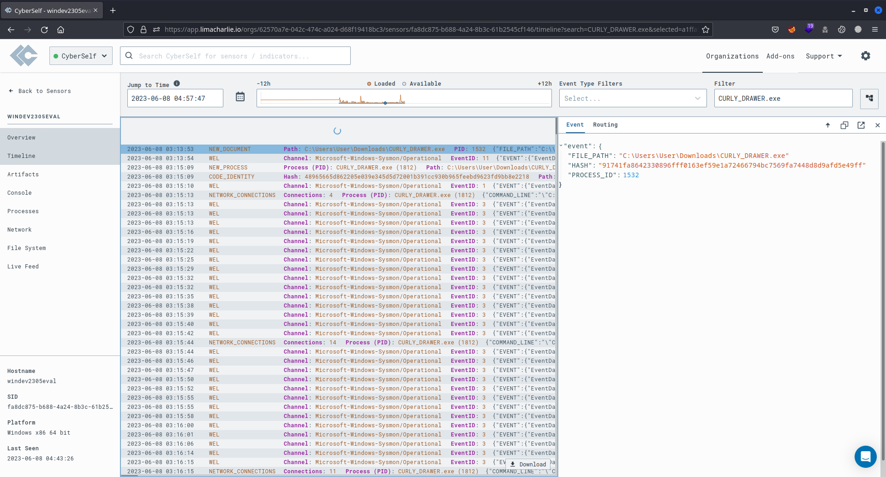

### LimaCharlied Timeline event of the payload execution on Windows Machine

### LimaCharlied Timeline event of the payload connection to the Sliver C2
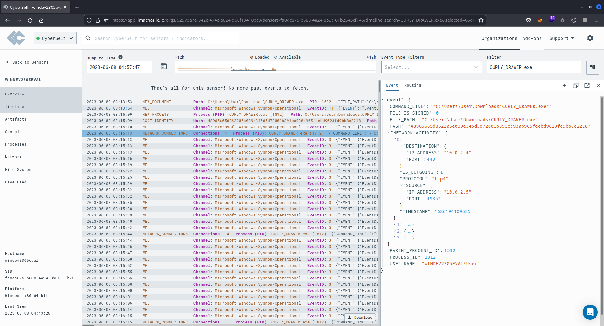

### Sliver C2 session on Attack Machine
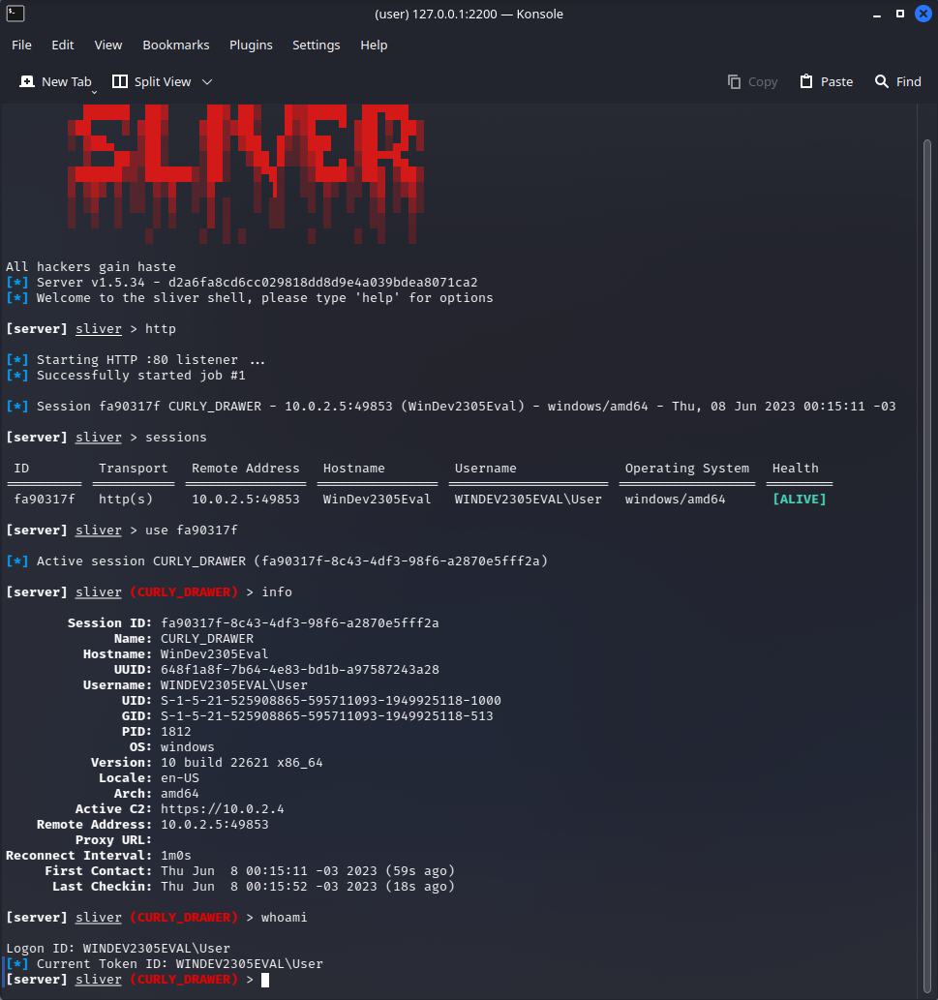

### LimaCharlie Processes showing the processes running on the Windows Machine including the payload `CURLY_DRAWER.exe`

## LSASS Access event, rule creation, and detection

### LimaCharlie Timeline showing LSASS access event
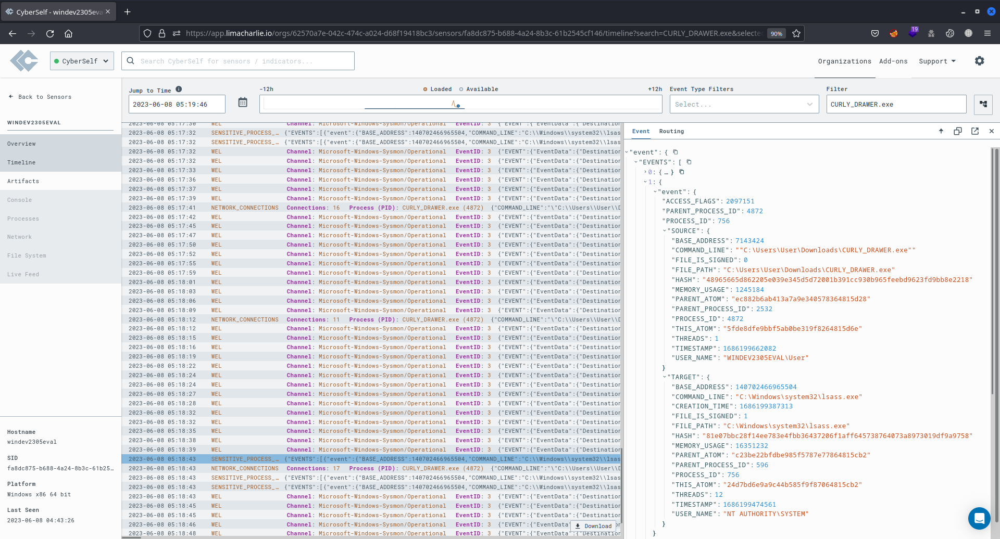

### LimaCharlie Custom Detect & Respond Rule for LSASS Access
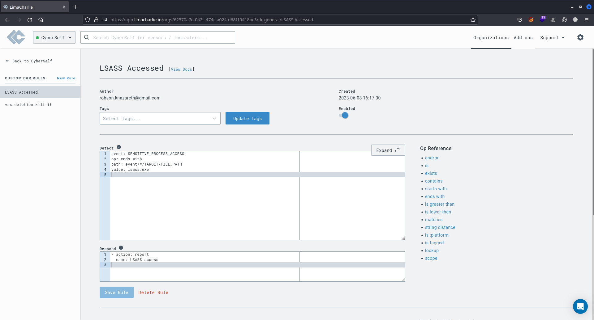

### LimaCharlie Detections showing LSASS access detected by custom rule created
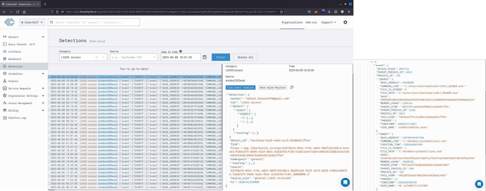

## Shadows Copies deletion event, rule creation, and detection

### LimaCharlie Timeline showing delete Shadows Copies event
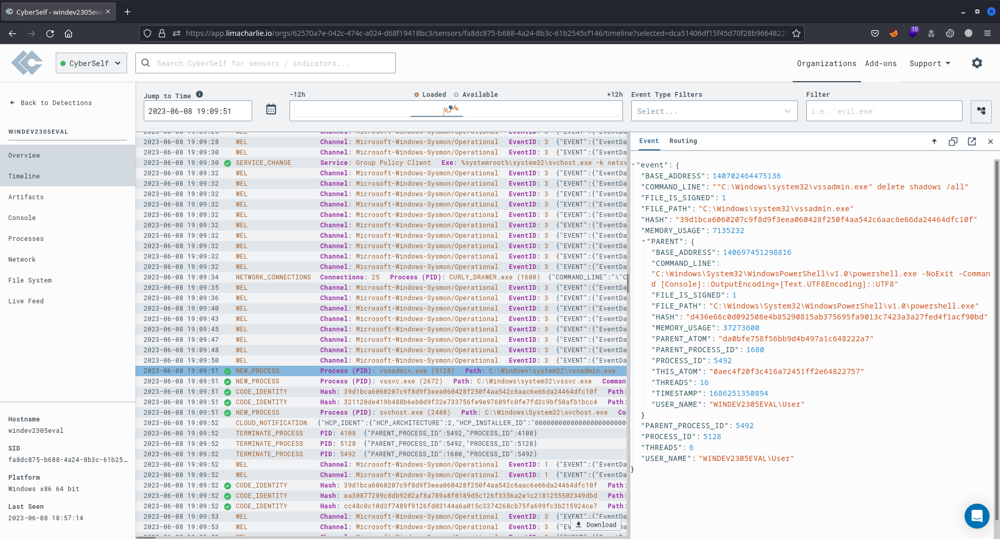

### LimaCharlie Custom Detect & Respond Rule for delete Shadows Copies

### LimaCharlie Detections showing delete Shadows Copies detected by custom rule created
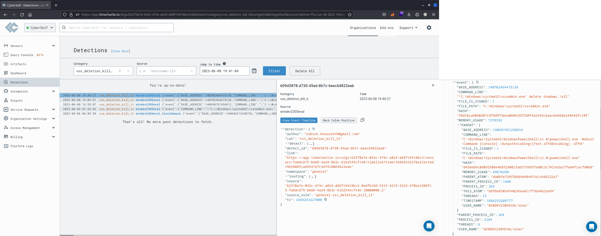

## Rules pre-loaded on LimaCharlie

### LimaCharlie Detections showing Sigma rule at category Non Interactive PowerShell Process Spawned
- Author: Roberto Rodriguez @Cyb3rWard0g (rule), oscd.community (improvements)
- Description: Detects non-interactive PowerShell activity by looking at the "powershell" process with a non-user GUI process such as "explorer.exe" as a parent."
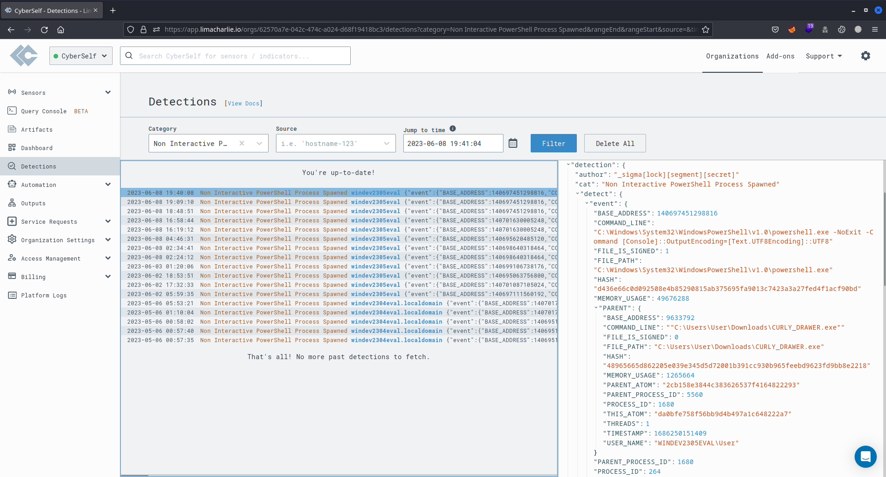

### LimaCharlie Detections showing rule from the category HackTool - Sliver C2 Implant Acrivity Pattern
- Author: Nasreddine Bencherchali (Nextron Systems), Florian Roth (Nextron Systems)
- Description: Detects process activity patterns as seen being used by Sliver C2 framework implants.
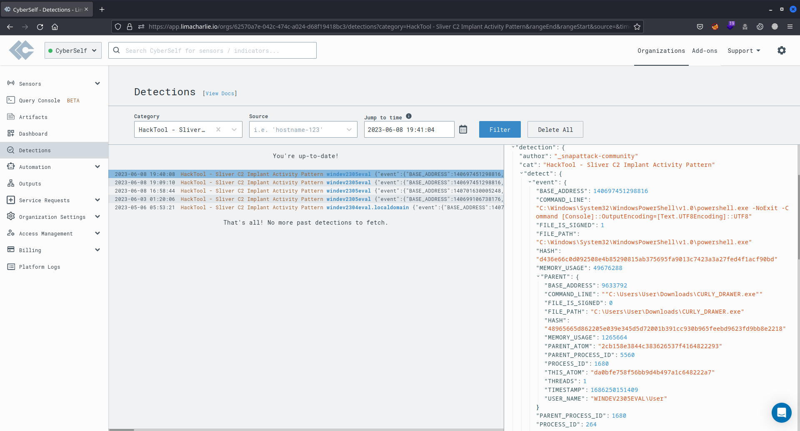

### LimaCharlie Detections showing rule from the category Silver Shell
- Author: Trenton Tait.
- Description: Detects the powershell command used when a Sliver agent creates an interactive shell with its built in shell command.
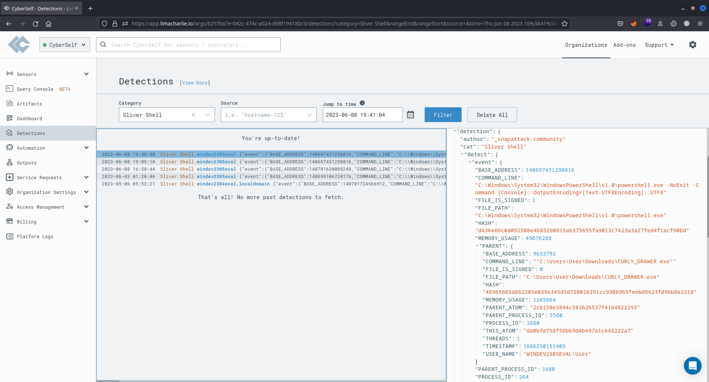

### LimaCharlie Detections showing Sigma rule from the category Shadow Copies Deletion Using Operating System Utilities
- Author: Florian Roth (Nextron Systems), Michael Haag, Teymur Kheirkhabarov, Daniil Yugoslavskiy, oscd.community, Andreas Hunkeler (@Karneades).
- Description: Shadow Copies deletion using operating systems utilities.
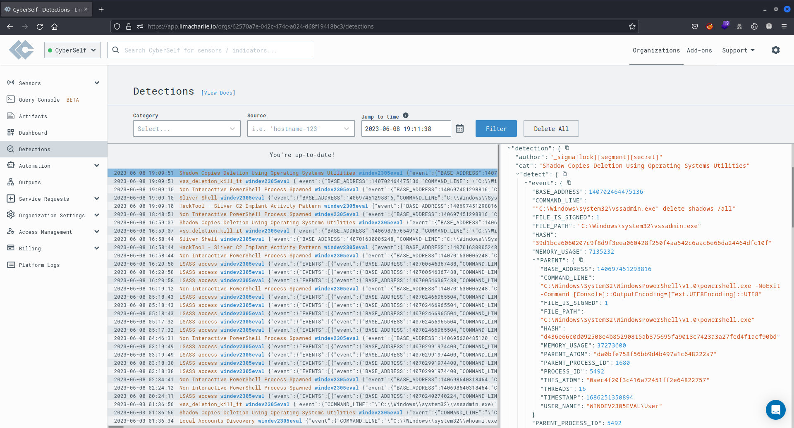

