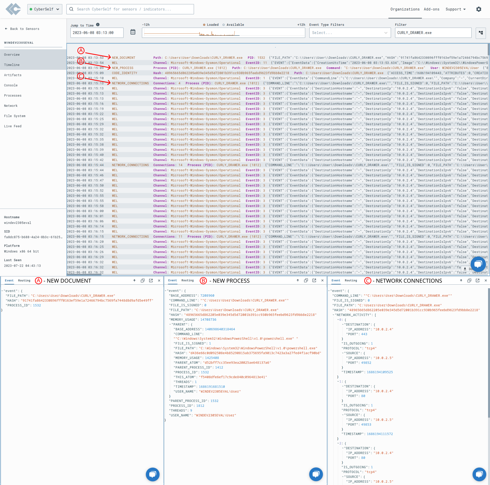

# Detection & Response with LimaCharlie (EDR)

In this lab, the LimaCharlie's detection and response (D&R) capabilities were explored by installing a LimaCharlie sensor on a Windows 11 (target) virtual machine and executing remote attacks on it from an Ubuntu Server (attack) virtual machine with Sliver installed, a Command & Control (C2) framework developed by BishopFox. Two different attacks were performed on the target machine during the test. First, access to the LSASS (Local Security Authority Subsystem Service) was gained on the target machine, simulating a credential stealing attack. Next, a volume shadow copies deletion was attempted using the vssadmin (Volume Shadow Copy Service administrative command-line tool) utility, a technique often associated with ransomware attacks. Specialized D&R rules were created using the LimaCharlie platform. These rules are designed to analyze the telemetry generated by the EDR solution, detect the two previously executed attacks, and take action. The efficacy of these rules was validated by repeatedly performing the attacks.

## Summary
- Configured in VirtualBox:
    - A Windows 11 (target) with Windows Defender disabled and Sysmon and LimaCharlie sensor installed.
    - A Ubuntu Server (attack) with Sliver C2 framework installed.
- Generated in Sliver a C2 payload and executed the payload on the target machine to start a Sliver C2 session on the attack machine.
- Used the Sliver C2 session to perform two attacks on the target machine:
    - LSASS access (credential stealing attack).
    - Volume shadow copies deletion using vssadmin Windows utility (used in ransomware attacks).
- D&R rules were created in the LimaCharlie platform to detect the two previous attacks and take action. The rules were tested by repeating the attacks.

## Procedure
The procedures to build this lab can be found [here](https://github.com/robsann/LimaCharlieEDRTelemetry/blob/main/procedure.md), and it was adapted from [Eric Capuano](https://blog.ecapuano.com/p/so-you-want-to-be-a-soc-analyst-intro).

## Diagram

### VirtualBox NAT Network
The configuration of the NAT Network used and the Port Forwarding Rule created to give access to the Ubuntu Server through SSH from the host machine. On NAT Network, the virtual machines can communicate with each other and the host machine and access the Internet through the host gateway. In contrast, the host can only communicate with the virtual machines through port forwarding.

### IP Addresses

# Highlights

## 1 - Windows 11 Setup

### 1.1 - Virus & Threat Protection Disabled
The Windows Defender was disabled to be able to perform malicious activities, such as downloading and executing the payload to establish the C2 session with Sliver.

### 1.2 - Sysmon Events
The Sysmon was installed to increase the telemetry gathered by LimaCharlie. Below is the last 10 Sysmon event retrieved by `Get-WinEvent` on PowerShell.

## 2 - Payload Generation and C2 Session

### 2.1 - Payload Generation
The C2 payload was generated on the Sliver C2 framework on the attack machine. It was named `CURLY_DRAWER.exe` randomly chosen by Sliver, and it was configured to connect to the attack machine when executed on another machine on the same network, opening a C2 session on Sliver.

### 2.2 - LimaCharlied Timeline Payload Events
The LimaCharlie's Timeline section showing some events from the target machine, including the events of the payload download (A), execution (B), and connection (C) to the attack machine.

### 2.3 - Sliver C2 Session
The Sliver C2 framework on the attack machine shows the C2 session established with the target machine using an http listener and previously generated payload. One the half bottom are some examples of information that can be gathered from the target machine.

### 2.4 - LimaCharlie Processes Section
In the Processes section on LimaCharlie, it can be seen the processes running on the target machine, including the payload `CURLY_DRAWER.exe` executed on PowerShell, with information about the network connection established.

## 3 - LSASS Access Attack (Credential Stealing)

### 3.1 - LSASS Access Event
The Timeline on LimaCharlie displays an event logged when the command `procdump -n lsass.exe -s lsass.dmp` was executed on the Sliver C2 session. This command was used to dump the `lsass.exe` process from memory. According to the event properties, the `CURLY_DRAWER.exe` file was where this process originated from, and `lsass.exe` was the file it was targeting.

### 3.2 - LSASS Access Custom D&R Rule
A custom D&R rule named LSASS Accessed for detecting LSASS access attacks was created based on the telemetry from the previously shown event logged during the LSASS access attack. This rule detects when the `lsass.exe` file is being used as the target of a process and generates an entry in the Detections section on LimaCharlie under the category LSASS access.

### 3.3 - LSASS Access Detection
The LimaCharlie's Detections section below shows the LSASS access attack detected by the custom D&R rule created in the previous subsection belonging to the LSASS access category and named LSASS Accessed.

## 4 - Volume Shadow Copies Deletion Attack

### 4.1 - Volume Shadow Copies Deletion Event
On the LimaCharlie's Timeline, an event was logged when the command `vssadmin delete shadows /all` was carried out on the Sliver C2 session system shell. This command deletes volume shadow copies typically used in ransomware attacks. The event properties show that the `powershell.exe` executed the command `"C:\Windows\system32\vssadmin.exe" delete shadows /all` to delete any volume shadow copies that may exist.

### 4.2 - Volume Shadow Copies Deletion Custom D&R Rule
Based on the telemetry from a logged event during a volume shadow copies deletion attack, a custom D&R rule called vss_deletion_kill_it was created. This rule identifies when the Windows vssadmin utility on the monitored machine executes the command `"C:\Windows\system32\vssadmin.exe" delete shadows /all`. If this attack is identified, an entry is generated in the Detections section of LimaCharlie under the category vss_deletion_kill_it, and the connection with the remote machine conducting the attack is terminated.

### 4.3 - Volume Shadow Copies Deletion Detection
The entry below in LimaCharlie's Detections section shows the Volume Shadow Copies Deletion attack detected by the custom D&R rule created in the previous subsection. As a response, the rule terminated the connection with the attacker machine. The custom rule belongs to the vss_deletion_kill_it category and is named vss_deletion_kill_it.

## 5 - Pre-Loaded Rules Triggered by Sliver C2 Activity

### 5.1 - Sigma Rule at Category Non-Interactive PowerShell Process Spawned
This rule was developed by Roberto Rodriguez @Cyb3rWard0g (rule) and oscd.community (improvements). It detects non-interactive PowerShell activity by looking at the "powershell" process with a non-user GUI process such as "explorer.exe" as a parent or "CURLY_DRAWER.exe" in this case.

### 5.2 - Rule from the Category HackTool - Sliver C2 Implant Activity Pattern
This rule was developed by Nasreddine Bencherchali (Nextron Systems) and Florian Roth (Nextron Systems). It detects process activity patterns as seen being used by Sliver C2 framework implants.

### 5.3 - Rule from the Category Silver Shell
This rule was developed by Trenton Tait. It detects the powershell command used when a Sliver agent creates an interactive shell with its built-in shell command.

### 5.4 - Sigma Rule from the Category Shadow Copies Deletion Using Operating System Utilities
This rule was developed by Florian Roth (Nextron Systems), Michael Haag, Teymur Kheirkhabarov, Daniil Yugoslavskiy, Andreas Hunkeler (@Karneades), and oscd.community. It detects volume shadow copies deletion using operating systems utilities.

