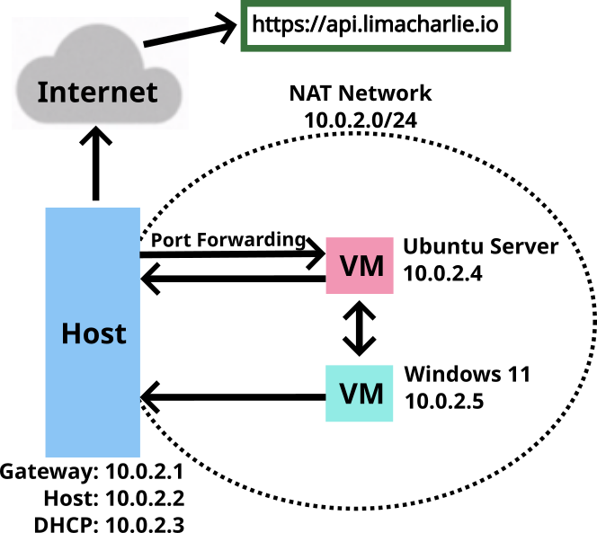

# Detection & Response with LimaCharlie (EDR)

In this lab, the detection and response capabilities of LimaCharlie (EDR) were verified by installing a LimaCharlie Sensor on a Windows 11 (target) virtual machine and executing remote attacks on it from an Ubuntu Server (attack) virtual machine with Sllver installed, a Command & Control (C2) framework developed by BishopFox. Two different attacks on the target machine were performed during the test. First, access to the LSASS (Local Security Authority Subsystem Service) was gained on the target machine, simulating a credentials-stealing attack. Next, a Shadow Copies deletion was attempted using the vssadmin.exe Windows utility, a technique often associated with ransomware attacks. Specialized Detection & Response Rules were created using the LimaCharlie (EDR) platform. These rules are designed to analyze the telemetry generated by our EDR solution and detect the two previously executed attacks. The efficacy of these rules was validated by repeatedly performing the attacks.

## Summary
- Configured in VirtualBox:
    - Windows 11 (Target) with Windows Defender disabled, Sysmon and LimaCharlie (EDR) Sensor installed.
    - Ubuntu Server (Attack) with Sliver installed, a Command & Control (C2) framework by BishopFox.
- Generated in Sliver a C2 payload, executed the payload on the Target Machine, and started a Sliver C2 session on the Attack Machine.
- Used the Sliver C2 session to perform two attacks on Target Machine:
    - LSASS access (credentials stealing attack).
    - Shadow Copies deletion using vssadmin.exe Windows utility (used in Ransomware attacks).
- Created Detection & Response Rules in LimaCharlie (EDR) platform to detect the two previous attacks using the telemetry generated and tested the rules by repeating the attacks.

## Procedure
The procedures to build this Lab can be found [here](https://github.com/robsann/LimaCharlieEDRTelemetry/blob/main/procedure.md), and it was adapted from [Eric Capuano](https://blog.ecapuano.com/p/so-you-want-to-be-a-soc-analyst-intro).

## Diagram

### VirtualBox NAT Network
The configuration of the NAT Network used and the Port Forwarding Rule created to give access to the Ubuntu Server through SSH from the host machine. On NAT Network, the virtual machines can communicate with each other and the host machine and access the Internet through the host gateway. In contrast, the host can only communicate with the virtual machines through port forwarding.

### IP Addresses

# Highlights

## 1 - Windows 11 Setup

### 1.1 - Virus & threat protection disabled
The Antivirus was disabled to be able to download and execute the payload to establish the C2 session with Sliver.

### 1.2 - Sysmon events
The Sysmon was installed to increase the telemetry gathered by LimaCharlie.

## 2 - Payload Generation and C2 Session

### 2.1 - Payload generation
The payload was generated on Sliver on the Attack Machine. It has the name `CURLY_DRAWER.exe`, and it is configured to try to connect to the Attack Machine when executed on another Machine on the same network.

### 2.2 - LimaCharlied timeline payload download event
The Timeline section on LimaCharlie shows the events of the Target Machine, including the payload download (A), execution (B), and connection to the Attack Machine (C) events.

### 2.3 - Sliver C2 session
The C2 session opened in Sliver on the Attack Machine, gathering some information from the Target Machine.

### 2.4 - LimaCharlie processes table
In the Processes section on LimaCharlie, it can be seen the processes running on the Target Machine, including the payload `CURLY_DRAWER.exe` executed on PowerShell, with information about the network connection established.

## 3 - LSASS Access Attack (Credential Stealing)

### 3.1 - LSASS Access Event

### 3.2 - LSASS Access Custom Detect & Respond Rule

### 3.3 - LSASS Access Detection
LimaCharlie Detections showing LSASS access detected by the custom rule created.

## 4 - Shadows Copies Deletion Attack

### 4.1 - Shadows Copies Deletion Event

### 4.2 - Shadows Copies Deletion Custom Detect & Respond Rule

### 4.3 - Shadows Copies Deletion Detection
LimaCharlie Detections showing delete Shadows Copies detected by the custom rule created.

## 5 - Pre-Loaded Rules Triggered by Sliver C2 Activity

### 5.1 - Sigma Rule at Category Non-Interactive PowerShell Process Spawned
This rule was developed by Roberto Rodriguez @Cyb3rWard0g (rule) and oscd.community (improvements). It detects non-interactive PowerShell activity by looking at the "powershell" process with a non-user GUI process such as "explorer.exe" as a parent or "CURLY_DRAWER.exe" in this case.

### 5.2 - Rule from the Category HackTool - Sliver C2 Implant Activity Pattern
This rule was developed by Nasreddine Bencherchali (Nextron Systems) and Florian Roth (Nextron Systems). It detects process activity patterns as seen being used by Sliver C2 framework implants.

### 5.3 - Rule from the Category Silver Shell
This rule was developed by Trenton Tait. It detects the powershell command used when a Sliver agent creates an interactive shell with its built-in shell command.

### 5.4 - Sigma Rule from the Category Shadow Copies Deletion Using Operating System Utilities
This rule was developed by Florian Roth (Nextron Systems), Michael Haag, Teymur Kheirkhabarov, Daniil Yugoslavskiy, Andreas Hunkeler (@Karneades), and oscd.community. It detects Shadow Copies deletion using operating systems utilities.

